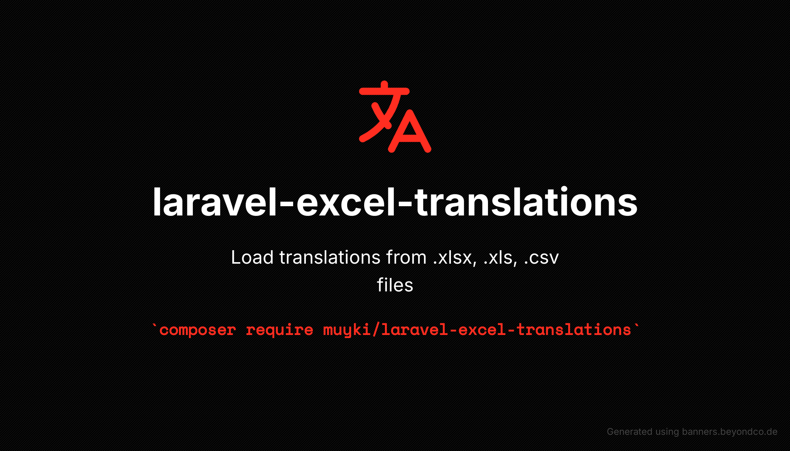

<p align="center">
  
</p>

# laravel-excel-translations

Laravel Excel Translations Package
This package allows you to load and use translation strings from Excel and CSV files in your Laravel application. It supports .csv, .xls and .xlsx file formats.

## Installation

1. **Install with Composer:**
```bash
composer require muyki/laravel-excel-translations
```

2. **Save Service Provider:**

It is automatically discovered for Laravel 5.5 and above. For older versions, add the following line to your config/app.php file:

```
'providers' => [
    // ...
    Muyki\LaravelExcelTranslations\LaravelExcelTranslationServiceProvider::class,
],
```

3. **Publish:**

You can publish the configuration file if you wish:

```bash
php artisan vendor:publish --provider="Muyki\LaravelExcelTranslations\LaravelExcelTranslationServiceProvider" --tag="config"
```

## Usage


### **Creating a New Translation File**

To create a new translation file, you can use the following command:

```bash
php artisan excel-translations:create
```

#### Example usage:

```bash
php artisan excel-translations:create
```

- You will be prompted to enter the file name, file format, and the languages.

    ```
    Enter the file name:
    > Default

    Select the file format [csv]:
    [0] csv
    [1] xls
    [2] xlsx
    > 2

    Enter the languages (comma-separated):
    > en

    Default.xlsx file already exists. Do you want to overwrite it? (yes/no) [no]:
    > no

    Operation cancelled.
    ```

#### Additional options:

You can also specify the file name, format, and languages directly in the command:

```bash
php artisan excel-translations:create translations --format=xlsx --languages=en,fr,de
```

- `--format` option: Specify the file format (`csv`, `xls`, `xlsx`).
- `--languages` option: Specify the languages as a comma-separated list (e.g., `en,fr,de`).

### **OR**

### **Prepare Language Files**:

   Place your translation files in the lang directory. Supported file formats:
    - .csv
    - .xls
    - .xlsx
    
    ### **File Structure Example**:

    | Key     | en      | tr           |
    |:--------|:-------:|-------------:|
    | welcome | Welcome | Hoş geldiniz |
    | goodbye | Goodbye | Güle güle    |

## Using Translations:

Use helper functions to get translations:

```
echo __e('file_name.key'); // Translation in default language
echo __e('file_name.key', [], 'tr'); // Translation in the specified language
```

Example:

```
echo __e('messages.welcome'); // 'Welcome'
echo __e('messages.welcome', [], 'tr'); // 'Hoş geldiniz'
```

## Customization

Caching Settings:

You can configure caching from the **config/excel_translations.php** file.

```
return [
    'cache' => [
    'expiration_time' => \DateInterval::createFromDateString('24 hours'),
    'key' => 'muyki.excel_translations.cache',
    'store' => 'default',
    ],
];
```
